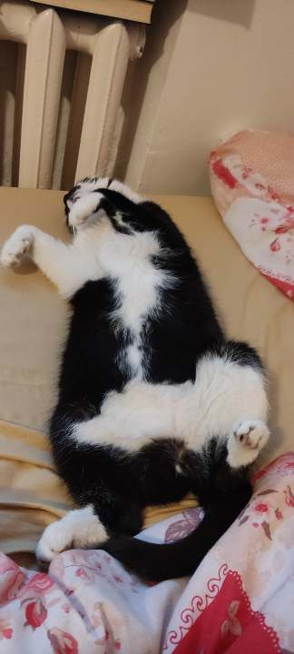

# Kitty OS Project

**Note**: This system is still under development. some things might be broken or missing. Drivers are under development and there are no applications (yet).
We're open to contributions from anybody and pull requests will be reviewed by me and other people when time comes.

KittyOS is meant to be a silly non-unix operating system for cat lovers and cats themselves.
There's still work going on with the kernel, drivers, APIs, etc.

